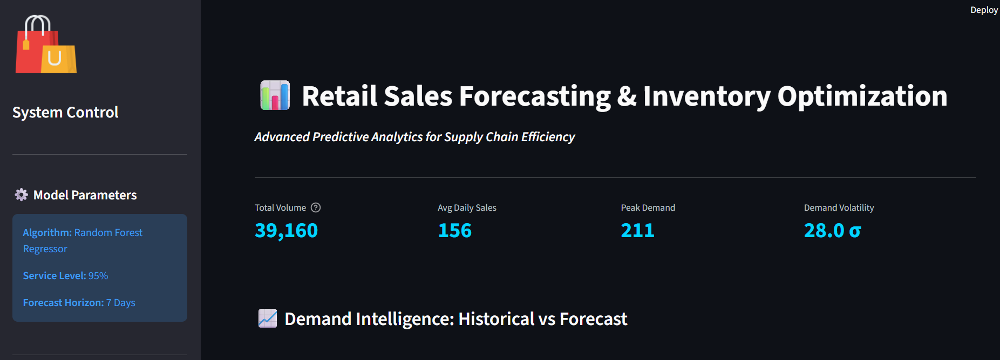
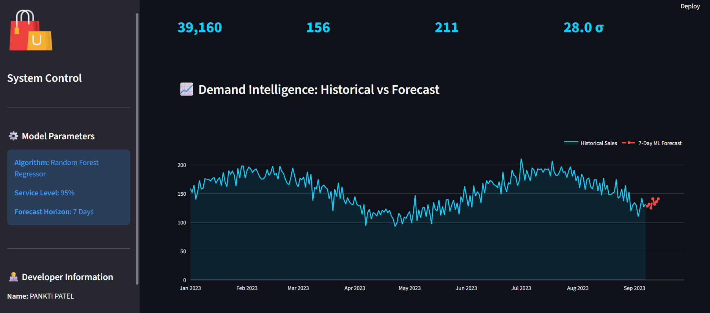
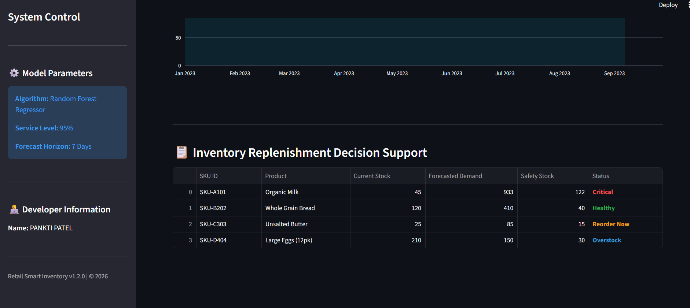

# 🛒 Retail Sales Forecasting & Inventory Optimization System

[](https://www.python.org/)
[](https://streamlit.io/)

This is a high-performance **Predictive Analytics Dashboard** that transforms raw retail data into inventory intelligence. It uses Machine Learning to forecast demand and automate stock replenishment.

---

## 📸 Project Visualizations (Direct View)

### 1 Executive Summary & Business KPIs
Real-time tracking of Total Units, Average Demand, and Sales Volatility.


### 2 ML-Powered Demand Forecasting
7-day predictive window visualized with interactive Plotly charts.


### 3 Inventory Replenishment Plan
Automated decision table with color-coded alerts for SKU management.


---

### 📈 Additional Data Insights (EDA)
Here are some more detailed views from the data analysis phase:

#### 4 Daily Sales Trend
Visualizing historical data to detect seasonality and patterns.


#### 5 Sales Distribution
Analysis of sales spread across different days of the week.


#### 6 Raw Data Preview
A look at the underlying dataset structure before processing.

---

## 🌟 Key Features
- **Predictive Intelligence:** 7-Day sales forecasting using Random Forest Regressor.
- **Inventory Engine:** Automated Safety Stock and Reorder Point (ROP) calculations.
- **Professional UX:** High-contrast dark-themed dashboard for high data readability.
- **Data Research:** Dedicated Jupyter notebook for deep-dive EDA.

---

## 📁 Project Architecture
```text
Retail_Project/
├── app.py              # Main Dashboard (Streamlit UI)
├── data_setup.py       # Dataset Generator script
├── asset/              # output
├── requirements.txt    # Project dependencies
├── README.md           # Documentation
├── data/               # Source: raw_sales_data.csv
├── models/             # Serialized ML models (.pkl)
└── notebooks/          # Exploratory Data Analysis (.ipynb)
